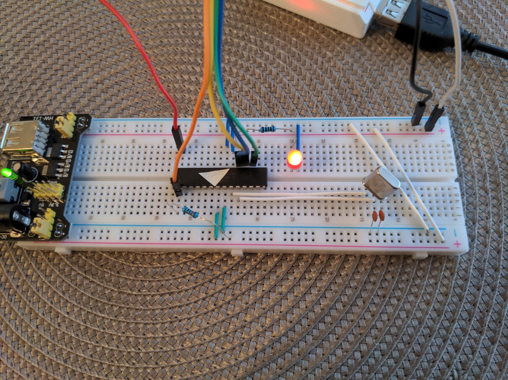
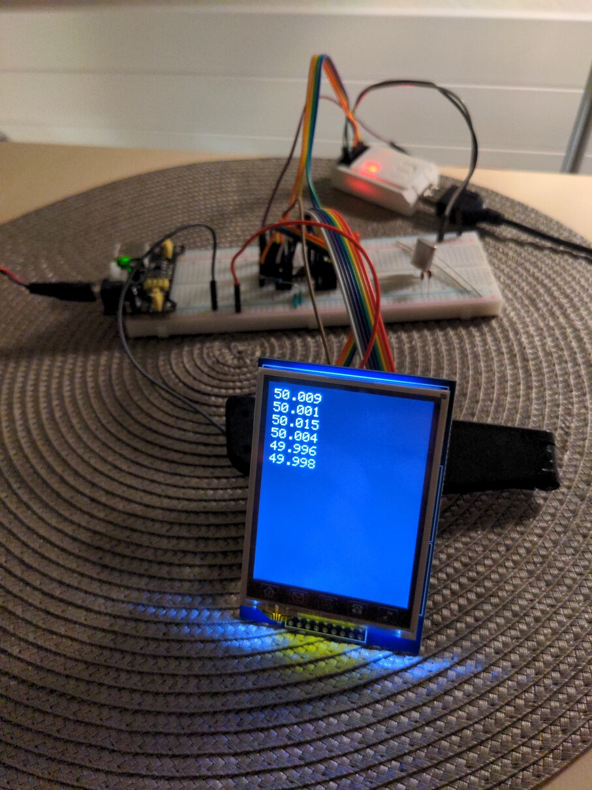

# Bestimmung der Netzfrequenz - Anpassungen und Erweiterungen

Die Frequenz wird zusätzlich zum Serial-Output auch auf dem einem 2.8 TTF-Display ausgegeben.

Die Genauigkeit konnte zudem durch folgende Massnahmen erhöht werden:

* Betrieb ohne Arduino Board direkt mit einem ATMega328P-Chip und einem 16MHz Quarz. Die Arduino Unos haben statt einem Quarz nur einen ungenaueren Resonator.
* PROBE_COUNT 500 statt 50. Ausgabe ist nun alle 10 Sekunden, aber dafür genauer und ohne Jitter.

Bei Testmessungen war die Abweichung zum Wert auf www.netzfrequenz.info unter 0.01 Hz.

# Aufbau
Schaltung mit ATMega328P-Chip und Quarz. Programmieradapter USBasp oben:

Ausgabe der Netzfrequenz auf TTF-Display:

# Ausblick

Messwerte auf SD-Karte schreiben.
